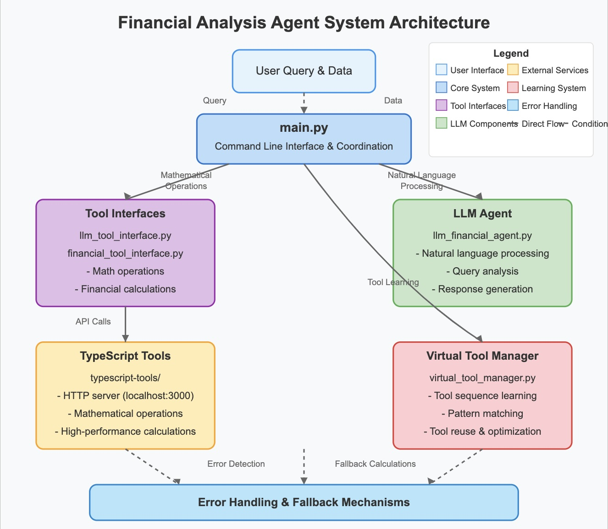

# Financial Analysis System



A comprehensive financial analysis toolkit that leverages TypeScript tools, virtual tool management, and LLM-based reasoning for advanced financial data analysis.

## Overview

This system provides an intelligent interface for financial data analysis through natural language queries. It combines:

- TypeScript-based mathematical tools
- Financial analysis capabilities (volatility, correlation, returns)
- Virtual tool management for learning and reusing successful analysis patterns
- LLM-powered reasoning that explains tool selection decisions

## Features

- **Natural Language Interface**: Query the system using plain English
- **Advanced Financial Metrics**: Calculate volatility, correlation, returns, and more
- **Explainable Tool Selection**: Understand why each tool was selected for your query
- **Tool Sequence Tracking**: See which TypeScript tools are used under the hood
- **Virtual Tool Learning**: The system learns from successful queries to create reusable tools
- **Comprehensive Reporting**: Get detailed analysis in both human-readable and JSON formats

## Project Structure

```
financial-analysis-system/
├── main.py                   # Main entry point
├── python_agent/             # Python agent components
│   ├── run_financial_analysis.py  # Standalone financial analysis
│   └── src/
│       ├── agents/           # Agent system components
│       ├── cache/            # Caching utilities
│       ├── tools/            # Tool implementations
│       └── utils/            # Utility functions
├── typescript-tools/         # TypeScript calculation server
│   ├── dist/                 # Compiled JavaScript
│   ├── src/                  # TypeScript source code
│   │   ├── index.ts          # Server entry point
│   │   ├── tools/            # Tool implementations
│   │   └── utils/            # Utility functions
│   └── package.json          # NPM dependencies
├── output/                   # Output directory for analysis results
│   ├── analysis_results.json # Example analysis output
│   └── run1.json             # Example run data
├── logs/                     # Log files directory
│   ├── financial_rl.log      # Main log file
│   └── financial_rl_error.log# Error log file
└── requirements.txt          # Python dependencies
```

## Installation

### Prerequisites

- Python 3.9+ (the project uses Python 3.9)
- Node.js (for TypeScript tools server)

### Setup

1. Clone the repository:
   ```
   git clone https://github.com/jazmiahenry/math-multi-agent.git
   cd math-multi-agent
   ```

2. Set up the Python virtual environment:
   ```
   # If using the existing fin_agent environment
   source fin_agent/bin/activate
   
   # Or create a new environment
   python -m venv fin_agent
   source fin_agent/bin/activate
   pip install -r requirements.txt
   ```

3. Start the TypeScript tools server:
   ```
   cd typescript-tools
   npm install
   npm start
   ```

## Usage

### Basic Usage

Run the main script with a natural language query and data source:

```bash
python main.py --query "Calculate volatility and correlations" --data financial_data.csv --output output/results.json
```

### Command Line Options

- `--query` or `--task`: Natural language query for analysis
- `--data`: Path to data file or comma-separated values
- `--output`: Path to output JSON file (default: output/analysis_results.json)
- `--verbose` or `--create-tool`: Additional options depending on the implementation

### Enhanced Analysis with Tool Reasoning

To use the enhanced version with tool reasoning:

```bash
python main.py --query "Calculate volatility and correlations" --data financial_data.csv --verbose
```

### Data Formats

The system supports various data formats:

1. **CSV Files** (like financial_data.csv)
2. **JSON Files** with array data or structured data
3. **Comma-separated values** directly on the command line

### Example Queries

#### Basic Statistics
```bash
python main.py --task "Calculate the mean, median, and standard deviation of this financial data" --data portfolio_data.json
```

#### Volatility Analysis
```bash
python main.py --task "Calculate volatility and correlations" --data output/run1.json
```

#### Comprehensive Analysis
```bash
python main.py --query "Perform comprehensive financial analysis including volatility, trends, and risk metrics" --data output/run1.json --verbose
```

#### Technical Analysis
```bash
python main.py --query "Calculate moving averages and identify trend reversals" --data portfolio_data.json --create-tool
```

## Virtual Tool System

The system can learn from successful analyses and create virtual tools for similar future tasks.

### Creating a Virtual Tool

Run an analysis with the `--create-tool` flag:

```bash
python main.py --query "Calculate 10-day rolling volatility" --data financial_data.csv --create-tool
```

Virtual tools are stored in the `.virtual_tools` directory (not visible in the current structure).

## Output Format

The system provides output in both human-readable format in the console and a detailed JSON file in the output directory.

### JSON Output Structure

```json
{
  "task": "Calculate volatility and correlations",
  "input_data": [...],
  "data_summary": {...},
  "success": true,
  "task_answer": "The volatility of the price series is 1.2345%...",
  "metrics": {...},
  "enhanced_tool_sequence": [
    {
      "step_id": 1,
      "tool": "calculate_volatility",
      "reasoning": "chosen because the query explicitly requests volatility calculation",
      "typescript_tools": ["std_deviation"],
      "payload": {"data": [...]}
    },
    {
      "step_id": 2,
      "tool": "calculate_correlation",
      "reasoning": "chosen because the query explicitly requests correlation analysis",
      "typescript_tools": ["mean", "std_deviation"],
      "payload": {}
    }
  ],
  "virtual_tool_used": null,
  "timestamp": "2025-04-07T20:15:30.123456"
}
```

## Financial Tool API

The system includes several key financial analysis tools:

### Basic Statistical Tools
- **mean**: Calculate arithmetic mean
- **median**: Calculate median value
- **mode**: Find most frequent values
- **standard_deviation**: Calculate standard deviation

### Advanced Financial Tools
- **calculate_volatility**: Calculate price volatility (standard deviation of returns)
- **calculate_correlation**: Calculate correlation between price series
- **calculate_returns**: Calculate percentage price returns
- **analyze_price_series**: Comprehensive price analysis including trends and patterns

## TypeScript Tools Server

The TypeScript tools server provides high-performance mathematical operations:

- Running on http://localhost:3000
- Exposes RESTful API endpoints for each mathematical tool
- Handles complex calculations like eigenvalue decomposition

### Available Endpoints
- `/tool/mean`: Calculate mean
- `/tool/median`: Calculate median
- `/tool/mode`: Calculate mode
- `/tool/std_deviation`: Calculate standard deviation
- `/tool/probability`: Calculate probability distribution
- `/tool/eigen`: Calculate eigenvalues and eigenvectors

## Extending the System

### Adding New TypeScript Tools

1. Add the new tool implementation to the TypeScript server in `typescript-tools/src/tools/`
2. Register the tool in the server's routing system
3. Add the Python wrapper in `python_agent/src/tools/`

### Adding New Financial Tools

1. Implement the new tool in the financial tools interface
2. Add TypeScript tool mappings if needed
3. Add reasoning documentation for the new tool

## Troubleshooting

### TypeScript Server Connection Issues

- Ensure the TypeScript server is running on port 3000
- Check logs in the `logs/` directory for error messages
- Verify network connectivity between Python and the server

### Data Format Problems

- Ensure your data is properly formatted (JSON, CSV)
- Check for non-numeric values in your datasets
- Verify file paths are correct

## License

This project is licensed under the MIT License - see the LICENSE file for details.
