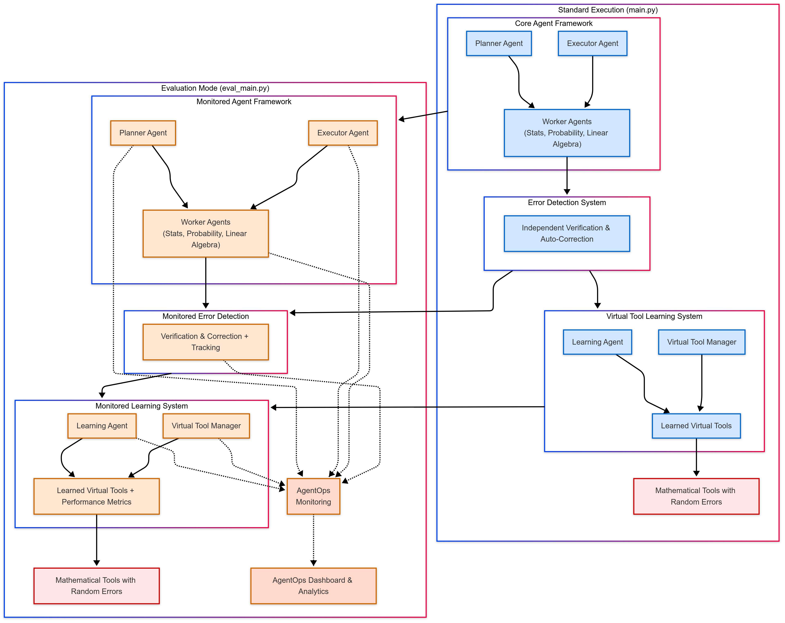

# Financial Multi-Agent System with Error Detection & Learning

A robust multi-agent system for financial analysis that can detect and recover from tool calculation errors and learn from successful execution patterns.

## Architectural Design

The system is built with a modular architecture consisting of the following components:

- **Core Agent Framework**
  - `PlannerAgent`: Designs analysis strategies with error mitigation approaches
  - `ExecutorAgent`: Coordinates execution with monitoring capabilities
  - `WorkerAgents`: Specialized agents for different mathematical domains

- **Error Detection System**
  - Independent verification of calculations using multiple methods
  - Automatic correction of identified errors
  - No modification to the underlying tool code

- **Virtual Tool Learning System**
  - `VirtualToolManager`: Manages tool sequences that have proven successful
  - `LearningAgent`: Observes, learns, and creates new virtual tools
  - Semantic caching of task patterns for efficiency

## How It Works

### Decision Making Process

1. **Planning Phase**
   - The planner creates a mathematical analysis plan customized to the problem
   - Plans include verification steps for error detection
   - The system checks if similar problems have been solved before

2. **Execution Phase**
   - Workers verify each calculation using alternative mathematical methods
   - Results with discrepancies are automatically recalculated
   - Execution paths are logged for learning

3. **Learning Phase**
   - Successful tool sequences are analyzed for reusability
   - The system identifies patterns for specific problem classes
   - Virtual tools are created with confidence metrics

### Error Detection Strategy

- Multiple calculation methods for cross-verification
- Statistical reasonableness checks on results
- Relative error thresholds for numeric comparisons


### Visual Representation of Design


## Running the System

```bash
# Install dependencies
pip install -r requirements.txt

# Basic usage
python main.py --data path/to/data.csv --task "Calculate monthly volatility and identify outliers"

# With interactive mode (allows for human input)
python main.py --data path/to/data.csv --task "Calculate monthly volatility and identify outliers" --interactive

# Evaluate data in an excel file
python main.py --data path/to/your/file.xlsx --task "Analyze monthly revenue trends and identify seasonality patterns" --sheet "Q2_Financials"

# Save results to file
python main.py --data path/to/data.csv --task "Calculate monthly volatility and identify outliers" --output results.json

# View available virtual tools
python main.py --show-tools
```

## Running with AgentOps
The Financial multi-agent system can be run with AgentOps for evaluation. Here is how to run:

```bash
# Install AgentOps
pip install agentops

# Set your API key
export AGENTOPS_API_KEY="your_api_key_here"

# Run analysis with monitoring
python eval_main.py --data your_data.xlsx --task "Analyze quarterly trends"

# Disable monitoring if needed
python eval_main.py --data your_data.xlsx --task "Analyze quarterly trends" --disable-monitoring
```

## Distinctive Features

- **Adaptive Learning Without Code Modification**: The system can identify and adapt to errors in mathematical tools without modifying their code.

- **Idempotent Virtual Tools**: Creates reusable "virtual tools" from successful sequences that solve specific problem classes.

- **Self-Improving Architecture**: System becomes more efficient and robust over time as it learns from experience.

- **Confidence-Based Execution**: Virtual tools track their success rates and adjust confidence levels accordingly.

- **Transparent Error Handling**: When errors are detected and corrected, the system provides clear explanations about the issue and resolution.

## Project Structure

The system is organized into several modules:

- `main.py`: Entry point with CLI interface
- `python_agent/`
  - `integration_module.py`: Core integration of all components
  - `learning_agent.py`: Implementation of the learning system
  - `virtual_tool_manager.py`: Virtual tool management
  - `multi_agent.py`: Core agent framework
  - `test_tools.py`: Mathematical tools (with simulated errors)